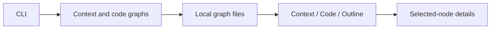

# Graft source overview

Source reference: commit `dbaf1ef3e3131cf305369b3419ad68a2faac0c66`. The diagram and links describe this revision; they are navigation rather than runtime qualification.

Graft combines a code/context graph engine, command-line entry point, browser viewer and a separate GitHub App review service. The viewer presents Context and Code graphs alongside a code Outline, with selected-node details, search, relation filters and zoom controls.

The viewer uses neutral light/dark panels, an indigo accent and semantic graph colors. Its Avenir Next, Segoe UI and system font fallbacks are declared in the viewer stylesheet.

## Source behavior

`viewer/main.ts` wires the three tabs and selected-node details. `viewer/data.ts` loads local graph endpoints or the inlined data of an exported page. Missing or empty context data has an explicit empty state; missing code data directs the reader to generate a code graph. Export metadata can restrict the available tabs and select the initial view.

The context loader fetches JSON without its own HTTP-status or rejection UI handler at this revision. Graph exports and source diagrams do not establish webhook-service health or review delivery.

## Source references

- [Viewer wiring](../viewer/main.ts)
- [Graph loading](../viewer/data.ts)
- [Graph rendering](../viewer/graph.ts)
- [Outline](../viewer/tree.ts)
- [Visual tokens](../viewer/style.css)
- [GitHub App guide](github-app.md)
